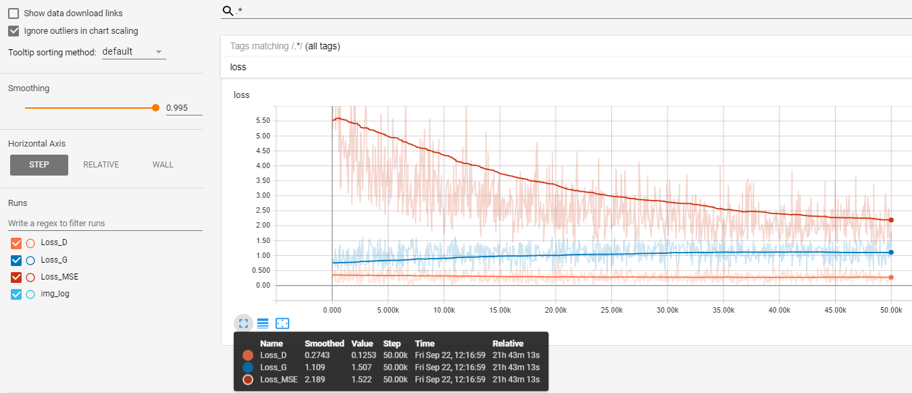

# PyTorch style transformer using CycleGAN

## Train-val log

## Validation Results
**Pastose -> Celluloid** (transformation)

**Celluloid -> Pastose** (transformation)

**Pastose -> Celluloid -> Pastose** (reconstruction)

**Celluloid -> Pastose -> Celluloid** (reconstruction)

## Notes
- Significant failures in the backgorund during transformation, but the reconstruction results still looks good. 
- Conditional discriminator should helps since there are kind of global color bias obeserved in the generated images, it should be denied easily as long as the discirminator works idealy during model training.

## Reference
1. [https://github.com/sunshineatnoon/Paper-Implementations/tree/master/cycleGAN](https://github.com/sunshineatnoon/Paper-Implementations/tree/master/cycleGAN)
